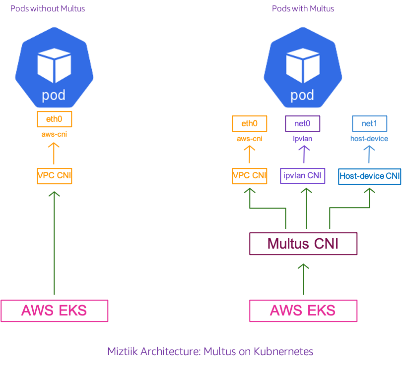

# Multus on EKS

The developer at Mystique Unicorn are having the need to seperate control plane, data plane and management plane traffic in their  applications. They are current running their application on kubernetes on AWS using EKS. They learnt that Multus meta CNI plugin can help.

Can you show them how the can get started with Multus on EKS?

## 🎯 Solutions

 Multus is a multi-container networking interface (CNI) plug-in lets you attach multiple network interfaces to a single pod and associate each with a different address range. AWS supports Multus meta CNI[1] plugin in EKS. Multus allows us to attach multiple network interfaces for pods. It is useful in various use cases; for examples:

1. **Traffic splitting**: Running network functions (NF) that require separation of control/management, and data/user plane network traffic to meet low latency Quality of Service (QoS) requirements.
2. **Performance**: Additional interfaces often leverage specialized hardware specifications such as Single Root I/O Virtualization (SR-IOV) and Data Plane Development Kit (DPDK), which bypass the operating system kernel for increased bandwidth and network performance.
3. **Security**: Supporting multi-tenant networks with strict traffic isolation requirements. Connecting multiple subnets to pods to meet compliance requirements.

Multus is deployed in your cluster as kubernetes custom resource definitions[CRD]. You provide the network configuration to this CRD. Any pod with an annotation `k8s.v1.cni.cncf.io/networks: NW-CONFIG-NAME` pointing to this CRD network configuration will have an additional interface provisioned (_for example, `k8s.v1.cni.cncf.io/networks: ipvlan-conf-1`_ ). You can read more about the implementation details here[2].

In this blog, I will show you how to setup

- A simple EKS cluster
- Install Multus Plugin
- Deploy two sample apps with multiple interfaces
- Establish connectivity between sample applications using secondary interfaces



1. ## 🧰 Prerequisites

   This demo, instructions, scripts and cloudformation template is designed to be run in `us-east-1`. With few modifications you can try it out in other regions as well(_Not covered here_).

   - 🛠 AWS CLI Installed & Configured - [Get help here](https://youtu.be/TPyyfmQte0U)
   - 🛠 AWS CDK Installed & Configured - [Get help here](https://www.youtube.com/watch?v=MKwxpszw0Rc)
   - 🛠 Python Packages, _Change the below commands to suit your OS, the following is written for amzn linux 2_
     - Python3 - `yum install -y python3`
     - Python Pip - `yum install -y python-pip`
     - Virtualenv - `pip3 install virtualenv`

2. ## ⚙️ Setting up the environment

   - Get the application code

     ```bash
     git clone https://github.com/miztiik/service-mesh-in-eks
     cd service-mesh-in-eks
     ```

3. ## 🚀 Prepare the dev environment to run AWS CDK

   We will use `cdk` to make our deployments easier. Lets go ahead and install the necessary components.

   ```bash
   # You should have npm pre-installed
   # If you DONT have cdk installed
   npm install -g aws-cdk

   # Make sure you in root directory
   python3 -m venv .venv
   source .venv/bin/activate
   pip3 install -r requirements.txt
   ```

   The very first time you deploy an AWS CDK app into an environment _(account/region)_, you’ll need to install a `bootstrap stack`, Otherwise just go ahead and deploy using `cdk deploy`.

   ```bash
   cdk bootstrap
   cdk ls
   # Follow on screen prompts
   ```

   You should see an output of the available stacks,

   ```bash
   eks-cluster-vpc-stack-001
   eks-cluster-stack-001
   ssm-agent-installer-daemonset-stack-001
   ```

4. ## 🚀 Deploying the application

   Let us walk through each of the stacks,

   - **Stack: eks-cluster-vpc-stack-001**
     To host our EKS cluster we need a custom VPC. This stack will build a multi-az VPC with the following attributes,

     - **VPC**:
       - 2-AZ Subnets with Public, Private and Isolated Subnets.
       - 1 NAT GW for internet access from private subnets

     Initiate the deployment with the following command,

     ```bash
     cdk deploy eks-cluster-vpc-stack-001
     ```

     After successfully deploying the stack, Check the `Outputs` section of the stack for the

   - **Stack: eks-cluster-stack-001**
     As we are starting out a new cluster, we will use most default. No logging is configured or any add-ons. The cluster will have the following attributes,

     - The control pane is launched with public access. _i.e_ the cluster can be access without a bastion host
     - `c_admin` IAM role added to _aws-auth_ configMap to administer the cluster from CLI.
     - One **OnDemand** managed EC2 node group created from a launch template
       - It create two `t3.medium` instances running `Amazon Linux 2`.
       - Auto-scaling Group with `2` desired instances.
       - The nodes will have a node role attached to them with `AmazonSSMManagedInstanceCore` permissions
       - Kubernetes label `app:miztiik_on_demand_ng`
       - A cluster user `emr-container` with access to AWS Service Role `AWSServiceRoleForAmazonEMRContainers`

     The EKS cluster will be created in the custom VPC created earlier. Initiate the deployment with the following command,

     ```bash
     cdk deploy eks-cluster-stack-001
     ```

     After successfully deploying the stack, Check the `Outputs` section of the stack. You will find the `**ConfigCommand**` that allows yous to interact with your cluster using `kubectl`

   - **Stack: ssm-agent-installer-daemonset-stack-001**
     This EKS AMI used in this stack does not include the AWS SSM Agent out of the box. If we ever want to patch or run something remotely on our EKS nodes, this agent is really helpful to automate those tasks. We will deploy a daemonset that will _run exactly once?_ on each node using a cron entry injection that deletes itself after successful execution. If you are interested take a look at the daemonset manifest here `stacks/back_end/eks_cluster_stacks/eks_ssm_daemonset_stack/eks_ssm_daemonset_stack.py`. This is inspired by this AWS guidance.

     Initiate the deployment with the following command,

     ```bash
     cdk deploy ssm-agent-installer-daemonset-stack-001
     ```

     After successfully deploying the stack, You can connect to the worker nodes instance using SSM Session Manager.

5. ## 🔬 Testing the solution

   1. **Install Multus on EKS**

      This doc[3] has the k8s CRD manifest for multus configuration. Lets install that,

      ```bash
      kubectl apply -f https://raw.githubusercontent.com/aws/amazon-vpc-cni-k8s/master/config/multus/v3.7.2-eksbuild.1/aws-k8s-multus.yaml
      ```

      Verify the installation. Each node should have one pod named `kube-multus-ds`.

      ```bash
      kubectl get pods -n kube-system
      ```
      Expected Output,

      ```bash
        $ kubectl get pods -n kube-system -l app=multus
        NAME                   READY   STATUS    RESTARTS   AGE
        kube-multus-ds-hfrhr   1/1     Running   3          2d18h
        kube-multus-ds-vhn9f   1/1     Running   3          2d18h
        kube-multus-ds-vwzgl   1/1     Running   2          2d18h
      ```

      Multus provides a Custom Resource Definition (CRD) named `NetworkAttachmentDefinition`. We’ll use this CRD to construct additional interface settings for different types of interfaces _(`macvlan or ipvlan or bridge`)_. Since K8s CRD have no context about our IP landscape, we need provide the IP ranges for our interfaces. You can learn more about the multus configurations here[4]

      When setting up the VPC, we created a _6_ subnet VPC and we have used the _public_ subnets for exposing the k8s API server, _private_ for running the pods. The _isolated_ subnets have been marked for _db_ usage. For this demonstration we will be configuring our multus plugin to use IPs from this subnet.
      
      The following configuration, creates a network attachment definition(targeted towards the CRD`) that will be read by the CRD and provision additional interfaces when ever a new pod comes up.

      ```yaml
      apiVersion: "k8s.cni.cncf.io/v1"
      kind: NetworkAttachmentDefinition
      metadata:
        name: ipvlan-conf-1
      spec:
        config: '{
            "cniVersion": "0.3.0",
            "type": "ipvlan",
            "master": "eth1",
            "mode": "l3",
            "ipam": {
              "type": "host-local",
              "subnet": "10.10.5.0/24",
              "rangeStart": "10.10.5.2",
              "rangeEnd": "10.10.5.80",
              "gateway": "10.10.5.1"
            }
          }'
      ```

      Verify the configurations have been processed correctly,

      ```bash
      kubectl describe network-attachment-definitions
      ```
      Expected Output,

      ```bash
      kubectl describe network-attachment-definitions
      Name:         ipvlan-conf-1
      Namespace:    default
      Labels:       <none>
      Annotations:  <none>
      API Version:  k8s.cni.cncf.io/v1
      Kind:         NetworkAttachmentDefinition
      Metadata:
        Creation Timestamp:  2022-08-15T21:07:21Z
        Generation:          1
        Managed Fields:
          API Version:  k8s.cni.cncf.io/v1
          Fields Type:  FieldsV1
          fieldsV1:
            f:metadata:
              f:annotations:
                .:
                f:kubectl.kubernetes.io/last-applied-configuration:
            f:spec:
              .:
              f:config:
          Manager:         kubectl-client-side-apply
          Operation:       Update
          Time:            2022-08-15T21:07:21Z
        Resource Version:  215991
        UID:               729162a4-8bed-4a53-bc31-d868c9211282
      Spec:
        Config:  { "cniVersion": "0.3.0", "type": "ipvlan", "master": "eth1", "mode": "l3", "ipam": { "type": "host-local", "subnet": "10.10.5.0/24", "rangeStart": "10.10.5.2", "rangeEnd": "10.10.5.80", "gateway": "10.10.5.1" } }
      Events:    <none>
      ```

      We are all set to launch our sample applications. You can find the sample manifests in `multus-on-eks/stacks/k8s_utils/manifests` directory. First we will deploy a sample app with _one_ additional interface.

      ```bash
      kubectl apply -f multus-1-nic.yaml
      ```

      Verify the deployment,

      ```bash
      kubectl get pods -n default -l app=miztiik-1-nic-app
      ```

      If we verify the interfaces in this pod, we should be able to find two.

      ```bash
      kubectl exec -it miztiik-1-nic-app -- ip -d address
      ```

      Lets deploy another app with **two** interfaces, just by adding another annotation,

      ```bash
      kubectl apply -f multus-2-nic.yaml
      ```

      We can check there are two interfaces attached to this pod,

      ```bash
      kubectl exec -it miztiik-2-nic-app -- ip -d address
      ```

      We can also establish network communication between these two interfaces,

      ```bash
      kubectl exec -it miztiik-2-nic-app -- ping -I net1 <miztiik-1-nic-app-net1-ipaddress>
      ```

      The astute amongst you will instantly notice that, IPAM(IP Address Management) has to be managed independently to avoid overlaps. We will see, how to solve this in the future.****
6. ## 📒 Conclusion

Here we have demonstrated how to Multus to attach multiple interfaces to your pods. This solution obviously can be improved on the following areas,
1. How do we attach multiple interfaces to the EKS nodes so that we can segregate and distribute the traffic across different interfaces
1. How do manage IPs across multiple nodes and pods.

2. ## 🧹 CleanUp

If you want to destroy all the resources created by the stack, Execute the below command to delete the stack, or _you can delete the stack from console as well_

- Resources created during [Deploying The Application](#-deploying-the-application)
- Delete CloudWatch Lambda LogGroups
- _Any other custom resources, you have created for this demo_

```bash
# Delete from cdk
cdk destroy

# Follow any on-screen prompts

# Delete the CF Stack, If you used cloudformation to deploy the stack.
aws cloudformation delete-stack \
  --stack-name "MiztiikAutomationStack" \
  --region "${AWS_REGION}"
```

This is not an exhaustive list, please carry out other necessary steps as maybe applicable to your needs.

## 📌 Who is using this

This repository aims to show how to setup EMR on EKS to new developers, Solution Architects & Ops Engineers in AWS. Based on that knowledge these Udemy [course #1][102], [course #2][101] helps you build complete architecture in AWS.

### 💡 Help/Suggestions or 🐛 Bugs

Thank you for your interest in contributing to our project. Whether it is a bug report, new feature, correction, or additional documentation or solutions, we greatly value feedback and contributions from our community. [Start here](/issues)

### 👋 Buy me a coffee

[](https://ko-fi.com/Q5Q41QDGK) Buy me a [coffee ☕][900].

### 📚 References


1. [AWS Blog: Multus Support Annoucement][1]
1. [Github: Multus Implementation][2]
1. [AWS Docs: Multus Installation][3]
2. [K8s Docs: Multus Configuration][4]

### 🏷️ Metadata


**Level**: 200

[1]: https://aws.amazon.com/blogs/containers/amazon-eks-now-supports-multus-cni/
[2]: https://github.com/aws-samples/eks-install-guide-for-multus/blob/main/README.md
[3]: https://docs.aws.amazon.com/eks/latest/userguide/pod-multiple-network-interfaces.html
[4]: https://github.com/k8snetworkplumbingwg/multus-cni/blob/master/docs/how-to-use.md


https://docs.vmware.com/en/VMware-Tanzu-Kubernetes-Grid/1.5/vmware-tanzu-kubernetes-grid-15/GUID-packages-cni-multus.html


[100]: https://www.udemy.com/course/aws-cloud-security/?referralCode=B7F1B6C78B45ADAF77A9
[101]: https://www.udemy.com/course/aws-cloud-security-proactive-way/?referralCode=71DC542AD4481309A441
[102]: https://www.udemy.com/course/aws-cloud-development-kit-from-beginner-to-professional/?referralCode=E15D7FB64E417C547579
[103]: https://www.udemy.com/course/aws-cloudformation-basics?referralCode=93AD3B1530BC871093D6
[899]: https://www.udemy.com/user/n-kumar/
[900]: https://ko-fi.com/miztiik
[901]: https://ko-fi.com/Q5Q41QDGK
